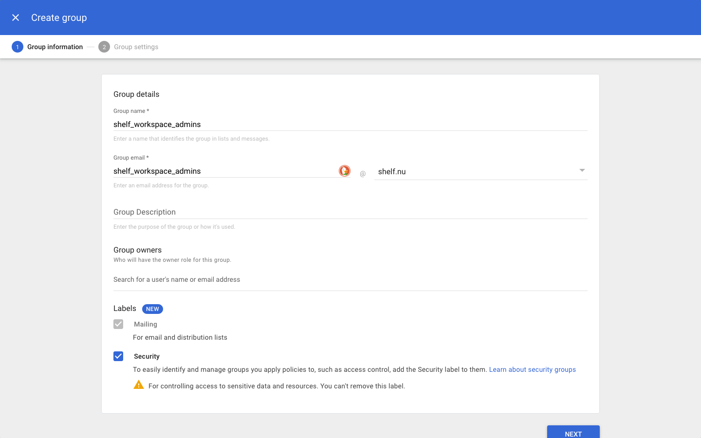
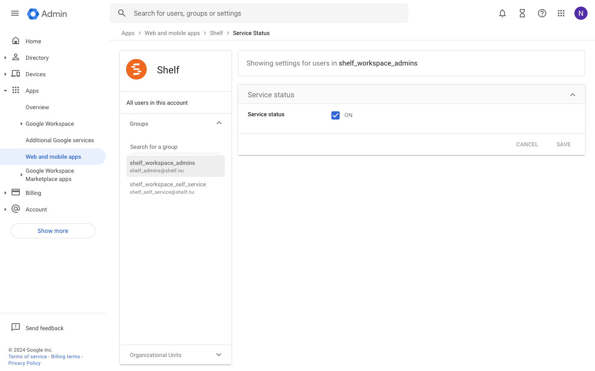
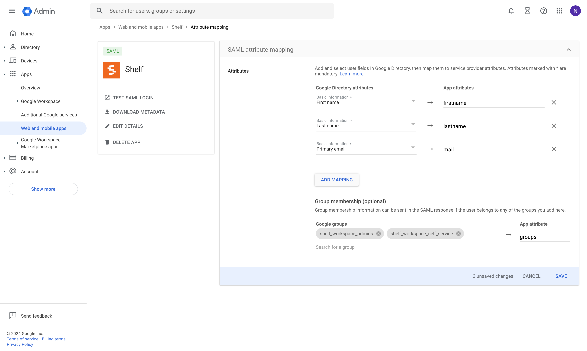
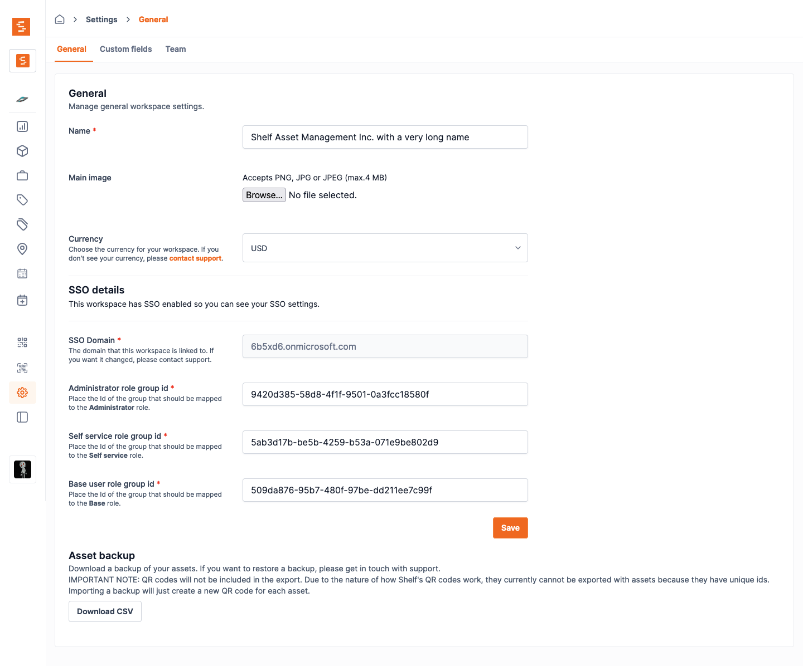

# Set Up SSO with Google Workspace

Shelf supports single sign-on (SSO) using Google Workspace (formerly known as GSuite).

## Step 1: Open the Google Workspace web and mobile apps console [#](#step-1-open-the-google-workspace-web-and-mobile-apps-console)

## Step 2: Choose Add custom SAML app [#](#step-2-choose-add-custom-saml-app)

From the _Add app_ button in the toolbar choose _Add custom SAML app_.

## Step 3: Fill out app details [#](#step-3-fill-out-app-details)

The information you enter here is for visibility into your Google Workspace. You can choose any values you like. Optionally enter a description.

## Step 4: Download IdP metadata [#](#step-4-download-idp-metadata)

This is a very important step. Click on _DOWNLOAD METADATA_ and save the file that was downloaded.

It's very important to send this file to your support contact at Supabase to complete the SSO setup process. If you're not sure where to send this file, you can always reach us at [hello@shelf.nu](mailto:hello@shelf.nu).

> [!IMPORTANT]
> Make sure the certificate as shown on screen has at least 1 year before it expires. Mark down this date in your calendar so you will be reminded that you need to update the certificate without any downtime for your users.

## Step 5: Add service provider details [#](#step-5-add-service-provider-details)

Fill out these service provider details on the next screen.

| Detail         | Value                                                                |
| -------------- | -------------------------------------------------------------------- |
| ACS URL        | `https://nmmqcuiasekdacmhwsxk.supabase.co/auth/v1/sso/saml/acs`      |
| Entity ID      | `https://nmmqcuiasekdacmhwsxk.supabase.co/auth/v1/sso/saml/metadata` |
| Name ID format | PERSISTENT                                                           |
| Name ID        | _Basic Information > Primary email_                                  |

## Step 6: Configure attribute mapping [#](#step-6-configure-attribute-mapping)

Attribute mappings allow Shelf to get information about your Google Workspace users on each login.

All attribute mappings are required. If in doubt, replicate the same config as shown in the screenshot below.

> [!NOTE]
> You will come back to this step at a later stage once you have your groups created and users assigned

## Step 7: Wait for confirmation [#](#step-7-wait-for-confirmation)

Once you’ve configured the Google Workspace app as shown above, make sure you send the metadata file you downloaded to your support contact at Shelf.

This information needs to be entered into Shelf before SSO is activated end-to-end.

Wait for confirmation that this information has successfully been added to Shelf. It usually takes us 1 business day to configure this information for you.

In the meantime, you can continue with the next steps that will show you how to setup your

## Step 8: Create groups and assign users [#](#step-8-create-groups-and-assign-users)

In order to manage which users get access to which workspace and with what role, Shelf uses groups for the mapping.
For each workspace you will have to create 2 groups, each one representing a different role in Shelf:

- Admin group
- Self service group

### 8.1: Create your groups in Google Workspace [#](#81-create-your-groups-in-google-workspace)

First step is to create the groups in the google workspace. Inside your admin panel, navigate to Directory > Groups > Create group

Add a name, email and make sure the group is labeled as security. Optionally fill in the other fields as well. Make sure to create 2 groups for each workspace, one for Admins and one for Self service users.

> [!NOTE]
> Due to how Google Workspaces works, it returns group names instead of IDs when the user tries to login. We recommend using lower cased group names without spaces, to avoid mismatch. This is not required, but can ensure a better integration.

### 8.2: Assign members to each group [#](#82-assign-members-to-each-group)

Once you have created your groups, you can assign any of your organization members to them. It is recommended that a member only belongs to 1 group within the same workspace. If they are added to both, the admin role will take precedence.

### 8.3: Allow groups to access Shelf app [#](#83-groups-to-access-shelf-app)

You can configure which Google Workspace user accounts will get access to Shelf. This is required as only users added to groups will be able to access Shelf.

You can configure this access by clicking on the _User access_ card (or down-arrow). Follow the instructions on screen.

Changes from this step sometimes take a while to propagate across Google’s systems. Wait at least 15 minutes before proceeding to the next step.

### 8.4: Map groups to app attributes [#](#84-map-groups-to-app-attributes)

Once you have created all your groups, you have to make sure to add them to the attributes returned by the app.

Make sure to add all groups that you want to access Shelf. The **_App attribute_** name should be **_groups_**

## Step 9: Map Google workspace groups inside Shelf [#](#step-9-map-google-workspace-groups-inside-shelf)

Once you have the groups ready, you need to add their names in the workspace settings inside Shelf. If you have multiple workspaces, you will need to map each one.

Go the the workspace settings and place the name of the ADMIN & SELF SERVICE groups.

> [!IMPORTANT]
> Those fields are case sensitive. The name should be placed exactly as the group name is in Google workspace.

## Step 10: Test single sign-on [#](#step-10-test-single-sign-on)

Once you’ve completed all the steps above, ask one of those users to help you out in testing the setup.

It often helps to ask them to log out of their Google account and log back in.

Ask them to enter the domain of their in the Login in with SSO page.

If sign in is not working correctly, reach out to your support contact at Shelf.
