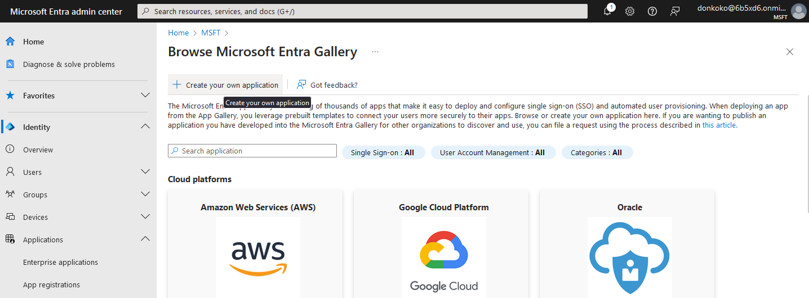
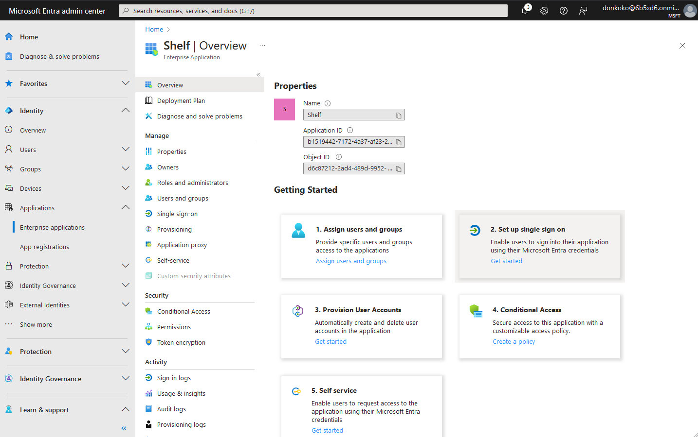
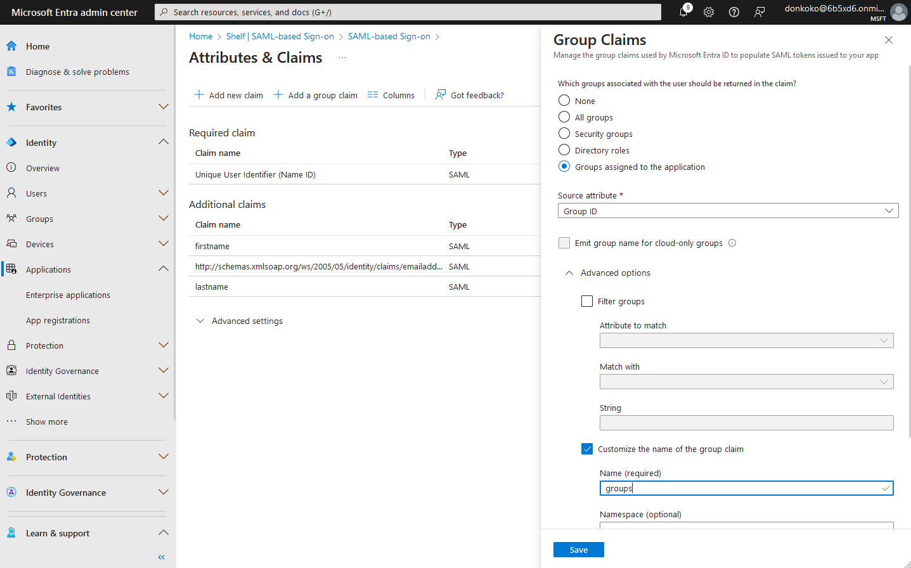
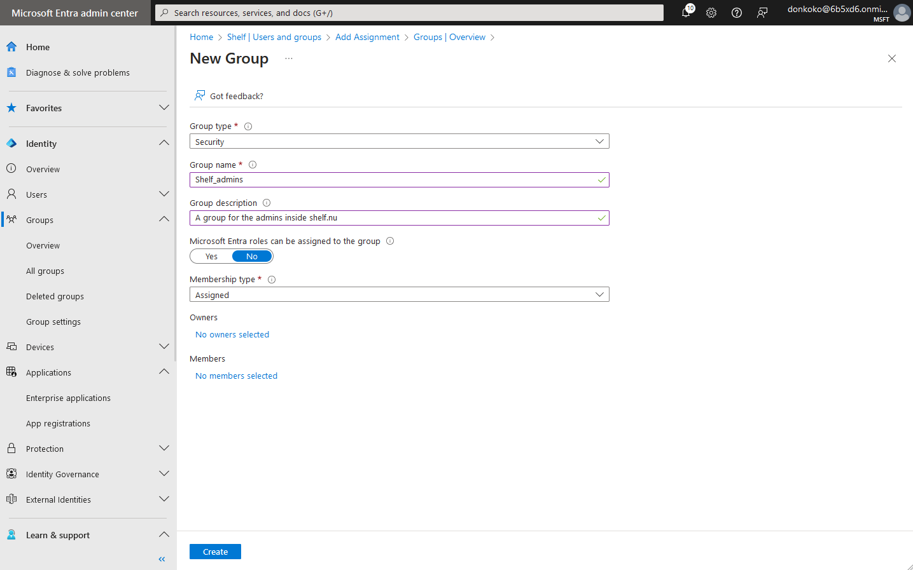
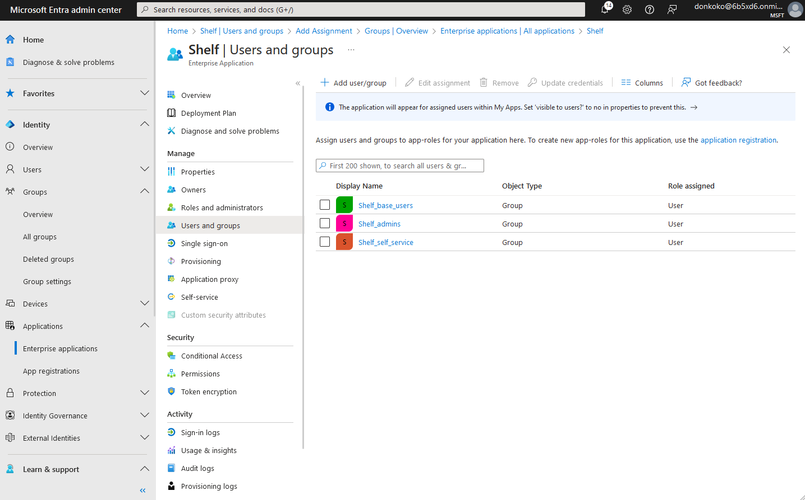

# Set Up SSO with Microsoft Entra

Shelf supports single sign-on (SSO) using Microsoft Entra.

## Step 1: Add and register an Enterprise application [#](#step-1-add-and-register-an-enterprise-application)

Open the Microsoft Entra dashboard and navigate to the [Overview](https://entra.microsoft.com/#view/Microsoft_AAD_IAM/TenantOverview.ReactView?Microsoft_AAD_IAM_legacyAADRedirect=true).

Click the _Add_ button then Enterprise application.

## Step 2: Choose Create your own application [#](#step-2-choose-create-your-own-application)

You'll be using the custom enterprise application setup for Shelf.

## Step 3: Fill out app details [#](#step-3-fill-out-app-details)

In the modal titled Create your own application, enter a display name for Shelf. This is the name your Entra users see when signing in to Shelf using SSO via Entra. We recommend to use the name Shelf.

Make sure to choose the third option: _Integrate any other application you
don't find in the gallery (Non-gallery)._

## Step 4: Choose the Set up single sign-on option [#](#step-4-choose-the-set-up-single-sign-on-option)

Before you get to assigning users and groups, which would allow accounts in Microsoft Entra to access Shelf, you need to configure the SAML details that allows Shelf to accept sign in requests from Microsoft Entra.

## Step 5: Select SAML single sign-on method [#](#step-5-select-saml-single-sign-on-method)

Shelf only supports the SAML 2.0 protocol for Single Sign-On, which is an industry standard.

## Step 6: Setup Basic SAML Configuration [#](#step-5-setup-basic-saml-configuration)

In order for the connection to work, you need to make sure your Enterprise application connects to Shelf.

Now you need to add the Service provider details. Insert the details from the table below and save them.

| Detail      | Value                                                                |
| ----------- | -------------------------------------------------------------------- |
| ACS URL     | `https://nmmqcuiasekdacmhwsxk.supabase.co/auth/v1/sso/saml/acs`      |
| Entity ID   | `https://nmmqcuiasekdacmhwsxk.supabase.co/auth/v1/sso/saml/metadata` |
| Relay State | `https://app.shelf.nu/oauthcallback`                                 |
| Name ID     | _Basic Information > Primary email_                                  |

## Step 7: Configure attribute mapping [#](#step-7-configure-attribute-mapping)

Attribute mappings allow Shelf to get information about your Microsoft Entra users on each login.
All attribute mappings are required. If in doubt, replicate the same config as shown in the screenshot below.

### Step 7.1: Remove all existing additional claims, except mail.

You should end up with your claims looking like this:

### Step 7.2: Add new attributes

The table below shows which values you need to use for each attribute. To add a new one, just click on _+ Add new claim_

| Name      | Source attribute |
| --------- | ---------------- |
| firstname | `user.givenname` |
| lastname  | `user.surname`   |

Example of adding a claim for `firstname`:

### Step 7.3: Add group claims

In order to be able to give the right permissions to your users in shelf, you need to assign them to group.

> [!NOTE]
> We will do that at a later stage. For now we just make sure to add the group claim so Microsoft Entra sends the correct data to shelf.

Click on the _ + Add a group claim_ button and fill in the information as seen below.

## Step 8: Obtain metadata URL and send to Shelf [#](#step-8-obtain-metadata-url-and-send-to-shelf)

In order for shelf to be able to connect to your newly created Enterprise Application you need to send the following information to your account manager:

- **Domain** - the domain which your users will use to sign-into shelf
- **App Federation Metadata URL** - you can find that URL in _section 3 SAML Certificates_ of the application you created:

It's very important to send this information to your support contact at Shelf to complete the SSO setup process. If you're not sure where to send this file, you can always reach us at [hello@shelf.nu](mailto:hello@shelf.nu).

Do not test the login until you have heard back from the support contact.

## Step 7: Wait for confirmation [#](#step-7-wait-for-confirmation)

Once you’ve configured the Microsoft Entra app as shown above, make sure you send the required information to your support contact at Shelf.

This information needs to be entered into Shelf before SSO is activated end-to-end.

Wait for confirmation that this information has successfully been added to Shelf. It usually takes us 1 business day to configure this information for you.

In the meantime, you can continue with the next steps that will show you how to setup your groups and users.

## Step 8: Create groups and assign users [#](#step-8-create-groups-and-assign-users)

In order to manage which users get access to which workspace and with what role, Shelf uses groups for the mapping.
For each workspace you will have to create 3 groups, each one representing a different role in Shelf:

- Admin group
- Self service group
- Base user group

### Step 8.1: Create groups

Navigate to Groups interface within Microsoft Entra and click click _New group_ to create the groups.
You can give the groups any name you desire.

The example above shows you what settings to use for creating a group. Once you have created the groups you can move to the next step.
Feel free to already add desired team members to each group.

### Step 8.2: Give access of the groups to the Shelf application

Navigate back to your Shelf enterprise application and go to _Users and Groups_.
Click _Add user/group_ and select the groups you just created.

Once confirmed you should end up with a setup similar to this:

## Step 9: Map Microsoft Entra groups inside Shelf [#](#step-9-map-google-workspace-groups-inside-shelf)

> [!NOTE]
> You can only complete this step, once you have received confirmation from your contact person at Shelf that the setup has been completed.
>
> Keep in mind that the OWNER of the workspace in shelf, cannot be an SSO user. The workspace needs to be created by a normal user. If you are having trouble with this, please feel free to contact your account manager to help it get resolved.

Once you have the groups ready, you need to add their IDs in the workspace settings inside Shelf. If you have multiple workspaces, you will need to map each one.

Go the the workspace settings and place the id of the ADMIN, BASE & SELF SERVICE groups. You can find the ID by clicking on each group in Entra and copying the _Object ID_

> [!IMPORTANT]
> Those fields are case sensitive. The name should be placed exactly as the group name is in Google workspace.

